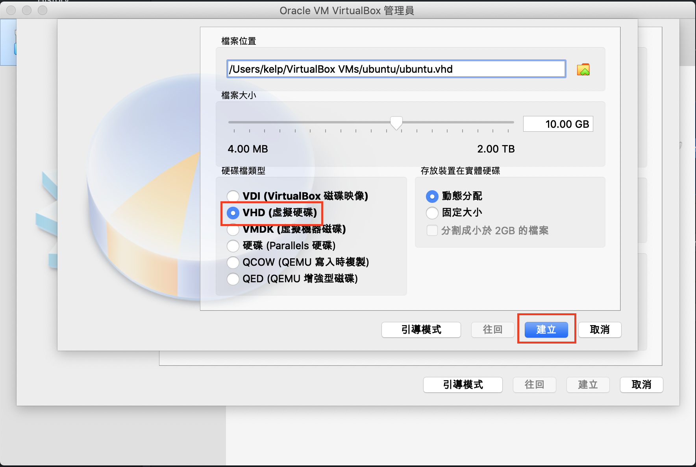
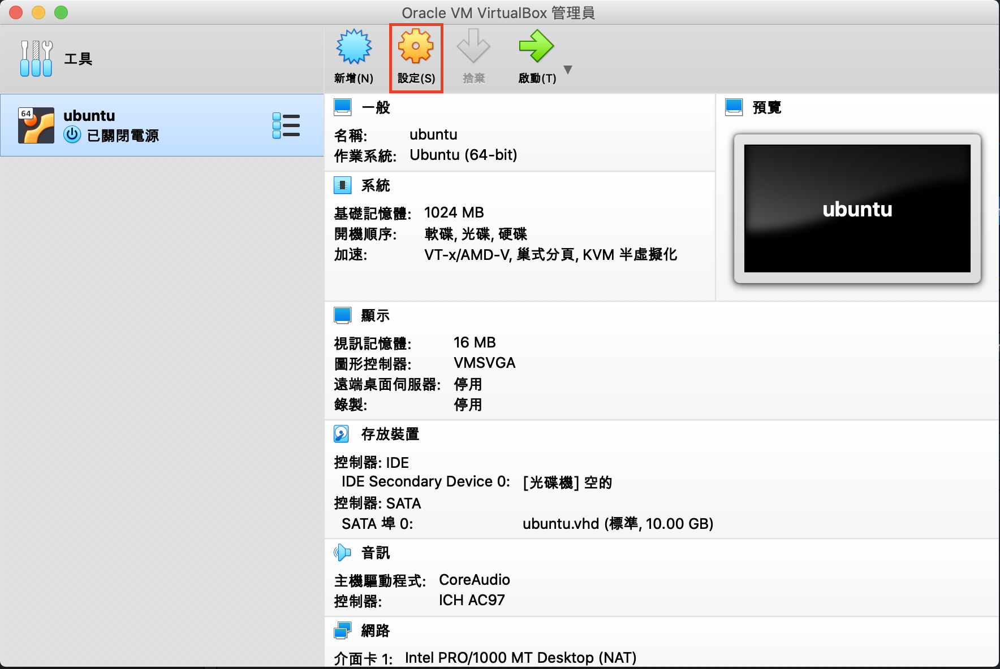
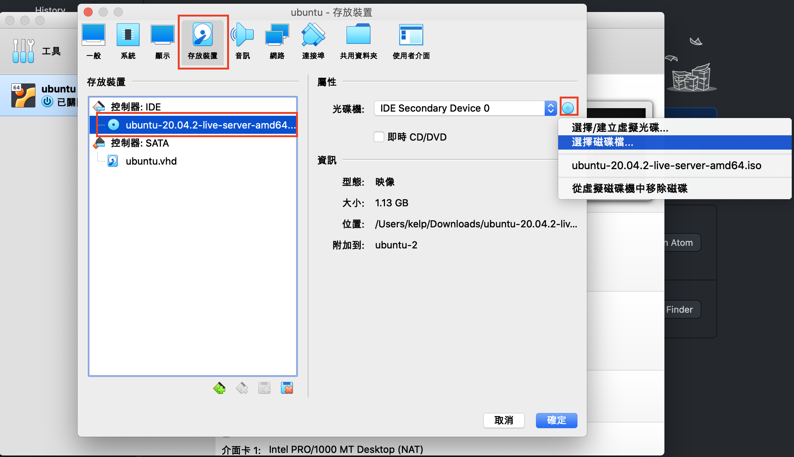
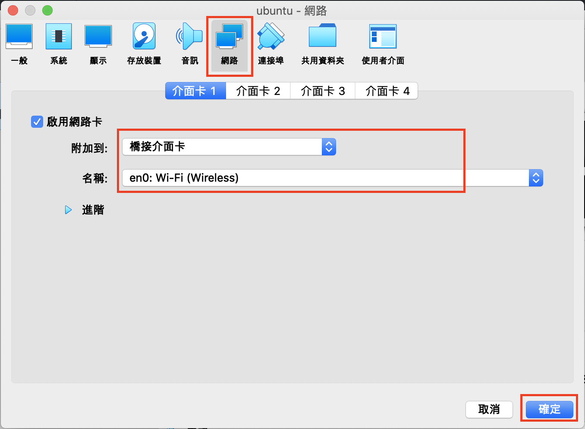
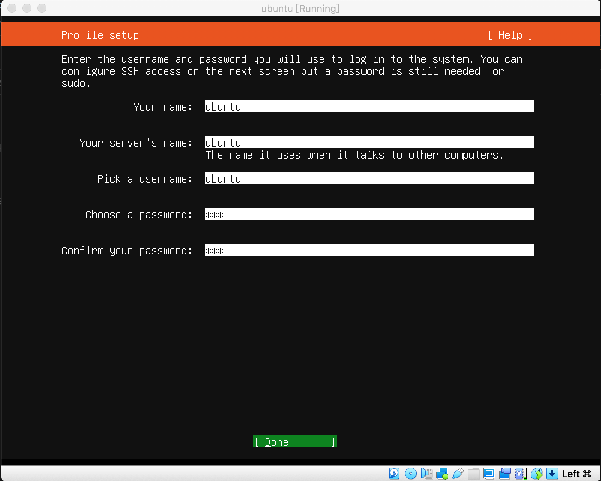
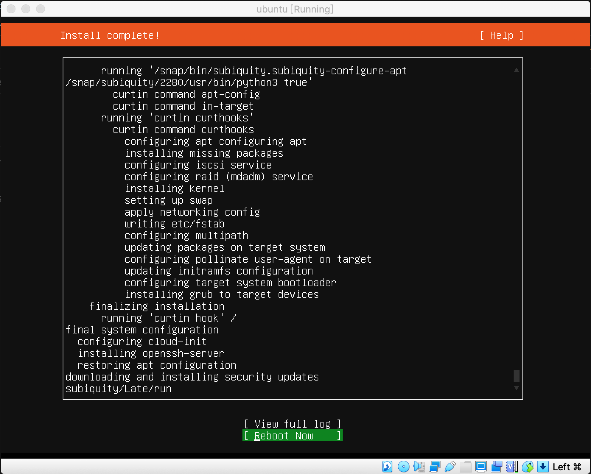

# chat
A chat room based on Socket.IO.

## Download VirtualBox and Ubuntu
+ https://www.virtualbox.org/wiki/Downloads
+ https://ubuntu.com/download/server

## Install ubuntu at VirtualBox











## Setup server
### Auth
#### Generate private, public key at the host.
```bash
# host
cd ~/.ssh
ssh-keygen
```
#### Setup authorized keys and sudo without the password.
```bash
# server
mkdir .ssh
cd .ssh
vi authorized_keys
# paste the public key then save
chmod 600 authorized_keys

cd /etc/sudoers.d
sudo vi ubuntu
```
>/etc/sudoers.d/ubuntu
> ```
> # User rules for ubuntu
> ubuntu ALL=(ALL) NOPASSWD:ALL
> ```

#### Add ssh config at the host.
>~/.ssh/config
> ```
> Host ubuntu-chat
>     HostName 192.168.2.152
>     User ubuntu
>     IdentityFile ~/.ssh/id_rsa.demo
> ```


### Install applications
```bash
# Install ansible
brew install ansible
```
```bash
# Setup server
ansible-playbook ansible/setup-server.yml -e host=ubuntu-chat -e env=production

# Just deploy web application
ansible-playbook ansible/deploy.yml -e host=ubuntu-chat -e env=production
```


### Manually install nginx
```bash
sudo apt install nginx
```
#### Turn off server tokens
http://nginx.org/en/docs/http/ngx_http_core_module.html#server_tokens
> /etc/nginx/nginx.conf
> ```
> server_tokens off;
> ```

#### Enable gzip
http://nginx.org/en/docs/http/ngx_http_gzip_module.html#gzip
> /etc/nginx/nginx.conf
> ```
> gzip_vary on;
> gzip_types text/plain text/css application/json application/javascript text/xml application/xml application/xml+rss text/javascript;
> ```

#### Site config
> /etc/nginx/sites-available/chat
> ```
> upstream web_backend {
>     server 127.0.0.1:3000;
>     keepalive 32;
> }
> server {
>     server_name _;
>     listen 80;
>     listen [::]:80;
> 
>     location / {
>         proxy_pass http://web_backend;
>         proxy_http_version 1.1;
>         proxy_set_header X-Forwarded-For $remote_addr;
>         proxy_set_header Host $http_host;
>         proxy_set_header Upgrade $http_upgrade;
>         proxy_set_header Connection $http_connection;
>     }
> }
> ```

```bash
cd /etc/nginx/sites-enabled
ln -s ../sites-available/chat .
rm /etc/nginx/sites-enabled/default
sudo service nginx reload
```
+ [ip_hash](http://nginx.org/en/docs/http/ngx_http_upstream_module.html#ip_hash)
+ [Using the Forwarded header](https://www.nginx.com/resources/wiki/start/topics/examples/forwarded/)
+ [Embedded Variables: $remote_addr](https://nginx.org/en/docs/http/ngx_http_core_module.html#var_remote_addr)
+ [proxy_http_version](http://nginx.org/en/docs/http/ngx_http_proxy_module.html#proxy_http_version)
+ [NGINX as a WebSocket Proxy](https://www.nginx.com/blog/websocket-nginx/)


### Manually install node.js
https://github.com/nodesource/distributions#installation-instructions
```bash
curl -fsSL https://deb.nodesource.com/setup_14.x | sudo -E bash -
sudo apt install nodejs
```
#### What is `curl -fsSL` ?
https://explainshell.com/explain?cmd=curl+-fsSL+https%3A%2F%2Fdeb.nodesource.com%2Fsetup_14.x+%7C+sudo+-E+bash+-


### Manually install MongoDB
https://docs.mongodb.com/manual/tutorial/install-mongodb-on-ubuntu/
```bash
sudo apt install gnupg
wget -qO - https://www.mongodb.org/static/pgp/server-4.4.asc | sudo apt-key add -
echo "deb [ arch=amd64,arm64 ] https://repo.mongodb.org/apt/ubuntu focal/mongodb-org/4.4 multiverse" | sudo tee /etc/apt/sources.list.d/mongodb-org-4.4.list
sudo apt update
sudo apt install mongodb-org

sudo systemctl start mongod
sudo systemctl enable mongod
```


---


## Docker compose
```bash
docker build . -t chat-image
docker-compose -f docker-compose.yml up
```
